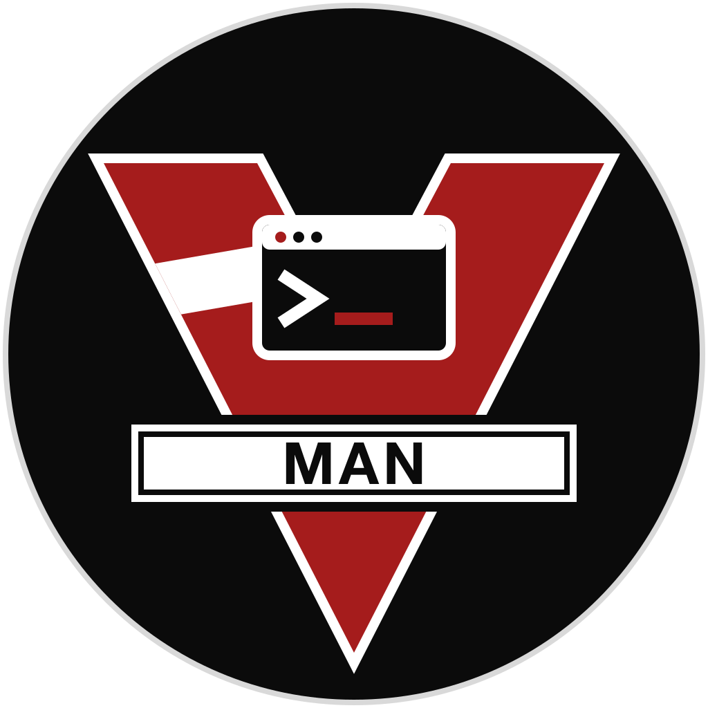

<p align="center">
  
</p>

# Man Page Catalog

A native macOS app that converts every man page on your system into a searchable PDF and lets you browse them in a clean three-column interface.

---

## Download & Install

**Step 1 — Download the app**

[Download ManPageCatalog-macOS.zip](ManPageCatalog-macOS.zip)

**Step 2 — Unzip and move to Applications**

Double-click the zip, then drag `Man Page Catalog.app` to your `/Applications` folder.

**Step 3 — Install dependencies**

Open Terminal and run:

```bash
brew install groff ghostscript
```

> Don't have Homebrew? Install it first: https://brew.sh

**Step 4 — Open the app**

Because this app is not signed with an Apple Developer certificate, macOS will block it on first launch.

To open it the first time:

1. Right-click `Man Page Catalog.app` in Finder and choose **Open**.
2. Click **Open** again in the security dialog.

On macOS 15 Sequoia and later, the dialog may only offer **Done** or **Move to Trash**. In that case:

1. Click **Done**.
2. Open **System Settings → Privacy & Security**.
3. Scroll to the **Security** section and click **Open Anyway** next to the message about `Man Page Catalog.app`.
4. Confirm with your password or Touch ID, then click **Open**.

You only need to do this once. After that it opens normally.

> [!WARNING]
> **Advanced: removing the quarantine flag in Terminal**
>
> The command below removes the `com.apple.quarantine` attribute, so Gatekeeper skips its first-launch check for this app. Use it only if the steps above don't work, and only on a copy you downloaded from this repository's releases or built yourself.
>
> ```bash
> xattr -dr com.apple.quarantine "/Applications/Man Page Catalog.app"
> ```

---

## Usage

**Step 1 — Generate PDFs**

Click the **↻ Generate** button in the toolbar. Choose an output folder (e.g. `~/ManPages`) and click **Generate**. A live progress bar shows how many pages have been rendered.

This only needs to be done once. Re-runs are fast — only changed pages are re-rendered.

**Step 2 — Browse**

Use the sidebar to filter by section (1–9). The middle column lists all man pages alphabetically.

**Step 3 — Search**

Type in the search bar to filter by name or description across all sections.

**Step 4 — Read**

Click any entry to view the PDF inline. Above the PDF you'll see:
- The command path (e.g. `/bin/ls`) — click the copy button to copy it
- The source file path (e.g. `/usr/share/man/man1/ls.1`)

Use **⌘R** or the menu bar to reload the catalog after re-generating.

---

## Requirements

- macOS 13 or later
- Homebrew: `brew install groff ghostscript`

---

## Build from source

```bash
brew install xcodegen
xcodegen generate
open ManPageCatalog.xcodeproj
```

Then hit **⌘R** in Xcode to run.

---

## License

Man Page Catalog is released under the [MIT License](LICENSE).
