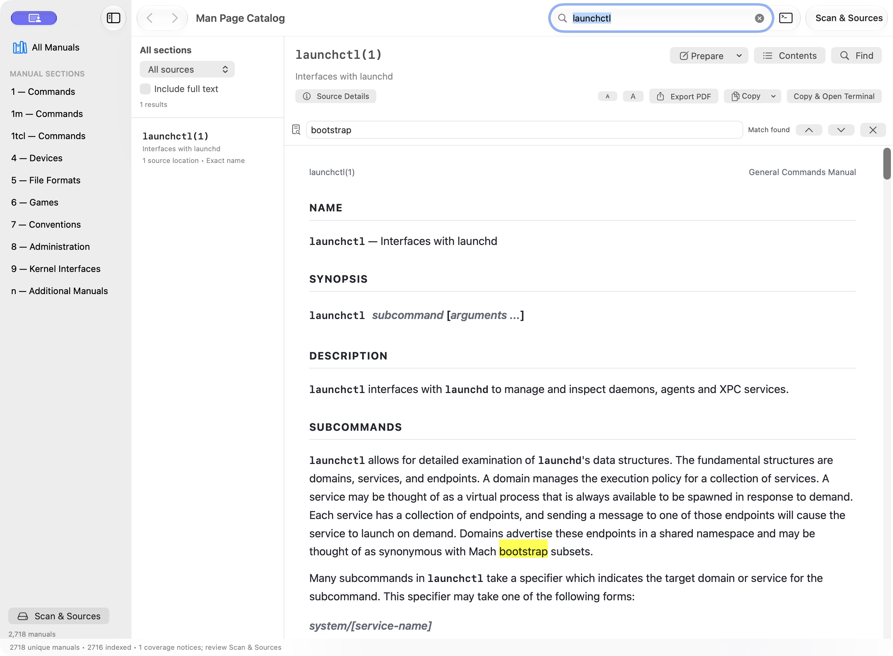
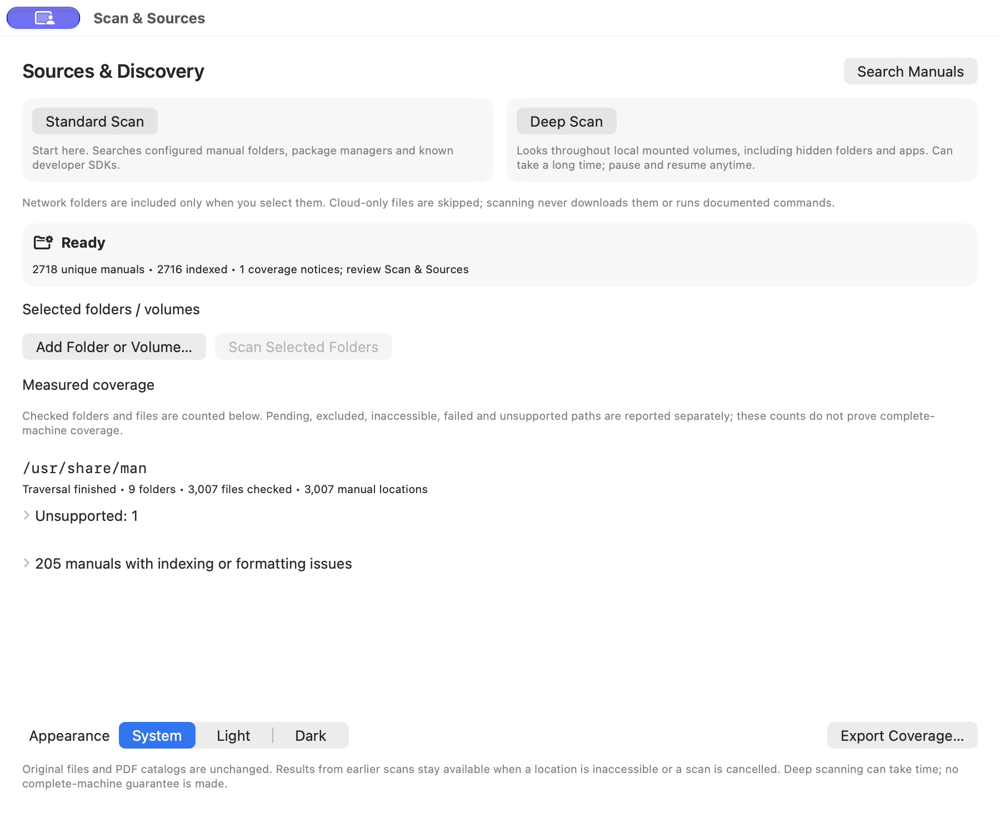

# ManPagesCatalog

<p align="center">
  
</p>

### Your Mac’s manuals, within reach — native search, readable documentation, PDF export, and an optional terminal


ManPagesCatalog brings the documentation already installed on your Mac into one searchable window. Find a command by name or topic, read its original manual with selectable text and linked references, check where it came from, and export a PDF when you need a portable copy. Developers can prepare an attributed command draft or open an embedded terminal alongside the documentation.

> **Scope:** Discovery, search, reading, and command preparation never execute a documented command. Running a draft or starting an interactive shell is a separate, explicit action on your real Mac. Deep Scan reports what it inspected and what it could not inspect; a completed traversal is not a guarantee that every manual on the machine was found.

This README describes the native [`v2.0.0-beta.1` prerelease](https://github.com/hideouts-io/ManPagesCatalog/releases/tag/v2.0.0-beta.1) and the matching ZIP tracked with this source. The older [`v1.0.0` release](https://github.com/hideouts-io/ManPagesCatalog/releases/tag/v1.0.0), dated March 29, 2026, contains the earlier PDF-generation app and its external dependencies.

## Contents

- [Start here](#start-here)
- [Current app and visual tour](#current-app-and-visual-tour)
- [Requirements and installation](#requirements-and-installation)
- [Scan and discover](#scan-and-discover)
- [Search and read](#search-and-read)
- [Prepare commands and use the terminal](#prepare-commands-and-use-the-terminal)
- [Keyboard shortcuts](#keyboard-shortcuts)
- [Local data and privacy](#local-data-and-privacy)
- [Troubleshooting](#troubleshooting)
- [Development and packaging](#development-and-packaging)
- [Validation and roadmap](#validation-and-roadmap)
- [Project boundaries and credits](#project-boundaries-and-credits)
- [Contributing and support](#contributing-and-support)
- [License](#license)

## Start here

A *manual page*, or *man page*, documents a command, programming interface, configuration file, or system convention. In `launchctl(1)`, `launchctl` is the name and `1` is the manual section. The sidebar gives sections descriptive labels, such as **Commands**, **File Formats**, and **Administration**.

1. Open **Man Page Catalog.app**. An empty library starts a Standard Scan; a saved library opens without starting another scan.
2. Press **⌘K**, type `launchctl`, and press **Return** to open the first result. You can also try a topic such as `network` or `processes`.
3. Read the manual in the right-hand pane. **Contents** jumps to a heading; the smaller/larger text controls adjust the reader.
4. Press **⌘F**, enter `bootstrap`, and use the previous/next arrows to move between matches in this page.
5. Open **Source Details** to see the exact manual path and any separately resolved executable path.
6. Choose **Export PDF** to save this manual through the macOS Save dialog.
7. Open **Scan & Sources** when you want to add a documentation folder, broaden discovery, resume a paused scan, or inspect coverage notices.

You can complete this walkthrough without opening a shell or running any command from the manual. Names become searchable while scanning continues; descriptions and full-text matches become available as indexing catches up.

## Current app and visual tour

| Search, read, and Find | Scan, index, and inspect coverage |
| --- | --- |
| [](docs/screenshots/search-read-find.png) | [](docs/screenshots/scan-sources.png) |

These are captures of the packaged native app using an isolated library limited to `/usr/share/man`. Counts reflect that test scope, not a whole-machine inventory. Coverage and formatter notices remain visible alongside usable results.

| Capability | What you can do | Current boundary |
| --- | --- | --- |
| **Native manual browser** | Read semantic HTML with headings, selectable text, references, and text sizing. | PDFs are an export format; reading does not require bulk PDF generation. |
| **Explicit search scope** | Search names, descriptions, related topics, similar spellings, and indexed full text; filter by section or source. | Full-text search covers indexed manuals only. |
| **Standard and Deep Scan** | Discover configured manuals or inspect accessible local mounted volumes, including hidden folders and application bundles. | Permissions, unsupported formats, and excluded locations limit coverage. |
| **Resumable discovery** | Pause, keep usable results, reopen the app, and resume queued locations. | Checkpoints require the same boot and a stable clock. |
| **Source provenance** | Inspect manual paths, identical-content locations, aliases, languages, and distinct versions. | A command found on PATH is not proof that its version matches the manual. |
| **PDF export** | Save one paginated, selectable PDF from its original source. | Unsupported or erroneous formatting is reported; exports are not silently substituted. |
| **Command Workspace** | Prepare and review a draft, choose its working folder, copy it, or explicitly run it in a fresh terminal session. | Runs with your Mac’s permissions; it is not an isolated practice environment. |
| **Native presentation** | Use keyboard shortcuts, descriptive controls, System/Light/Dark appearance, and the book/terminal branding. | Full VoiceOver and minimum-window validation remain on the roadmap. |

## Requirements and installation

| Requirement | Current support |
| --- | --- |
| Operating system | App deployment target: macOS 13 or later. The current runtime validation was on macOS 27. |
| Processor | The tracked development ZIP includes Apple Silicon and Intel slices. Intel hardware execution remains unverified. |
| Manual sources | Accessible local documentation; the app does not download a universal manual collection. |
| Runtime | Apple frameworks, system SQLite, and macOS manual/compression tools. No Python, Homebrew, groff, or Ghostscript runtime is required. |
| Building from source | Full Xcode with macOS SDK; validated with Xcode 27.0. SwiftPM resolves the pinned SwiftTerm package. |
| Test target | macOS 14 or later, as configured in `project.yml`. |

### Use the packaged prerelease

Download the app and SHA-256 checksum from the [`v2.0.0-beta.1` prerelease](https://github.com/hideouts-io/ManPagesCatalog/releases/tag/v2.0.0-beta.1), or use the matching [tracked application ZIP](ManPageCatalog-macOS.zip). It contains the branded app, licenses, and bundled terminal resources. Extract it and open **Man Page Catalog.app**. You can keep the app in a folder of your choice; the source checkout and an existing catalog are not runtime requirements.

The ZIP is ad-hoc signed and has not been Developer ID signed or notarized. If macOS blocks a downloaded copy, use a locally built application or wait for a notarized release. These instructions do not require disabling Gatekeeper or removing quarantine attributes.

### Build the current source

From this checkout, run:

```sh
xcodebuild -project ManPageCatalog.xcodeproj -scheme ManPageCatalog \
  -configuration Release -derivedDataPath build/ReleaseDerivedData \
  -destination 'generic/platform=macOS' build CODE_SIGN_IDENTITY=- \
  ONLY_ACTIVE_ARCH=NO ARCHS='arm64 x86_64'

open 'build/ReleaseDerivedData/Build/Products/Release/Man Page Catalog.app'
```

Use the checked-in Xcode project. XcodeGen is needed only when regenerating it after changing `project.yml`. If Xcode reports that the Metal toolchain is missing while compiling SwiftTerm’s shader resource, install that Xcode component with `xcodebuild -downloadComponent MetalToolchain`, then rebuild.

## Scan and discover

### Choose the right scan

| Option | Where it looks | When to use it |
| --- | --- | --- |
| **Standard Scan** | Configured man paths, common system/package-manager/user manual folders, known Xcode and macOS SDK locations, Command Line Tools, and selected folders. | First launch and routine refreshes. |
| **Deep Scan** | Accessible local mounted volumes, including hidden directories, applications, developer trees, SDKs, and nonstandard locations. | Documentation is missing from the usual folders, or you want a broader inventory. |
| **Add Folder or Volume…** | A folder or mounted volume you select, including hidden folders. | Include a specific installation or explicitly authorize a network subtree. Use **Scan Selected Folders** to scan those selections. |

Standard discovery uses `/usr/bin/manpath` and the platform’s man configuration. Common locations include `/usr/share/man`, `/usr/local/share/man`, `/opt/homebrew/share/man`, `/opt/local/share/man`, user manual directories, and developer SDK manual folders. A nonempty `MANPATH` bounds automatic Standard Scan roots; empty path components are expanded by `manpath`. Explicitly selected folders are still included.

Deep Scan does not use sudo, bypass macOS permissions, or automatically download cloud-only files. Network locations are traversed only beneath a folder you explicitly select. Unmounted volumes are outside the scan.

### Discovery and indexing are different stages

**Discovery** locates and validates candidate files. **Indexing** extracts descriptions and searchable text. Scan & Sources displays the current stage, location, counts, and available pause/resume controls. Search and the open manual remain usable while this work proceeds.

Use **Pause Scan** to save pending traversal, **Resume Discovery** to continue it, or **Index Discovered Manuals** when discovered manuals still need metadata. Pausing indexing preserves the indexed work already completed. A new Standard or Deep Scan replaces the pending traversal checkpoint.

Checkpoints are saved atomically about every five seconds between file operations and when paused. They are traversal snapshots, not filesystem change journals. After a reboot or a significant clock change, start a fresh scan. Filesystem changes made after a folder was visited may require a new scan even during the same boot.

A failed or cancelled scan preserves usable catalog entries and partial discoveries. Stale asynchronous results cannot replace a newer operation. Successful rescans can remove deleted entries from covered locations; a Standard Scan preserves earlier Deep Scan results outside its covered roots. **⌘R** performs an incremental Standard Scan, reusing unchanged source metadata and indexed content. It does not continuously monitor the filesystem or generate PDFs.

### Understand coverage

| Coverage state | Meaning |
| --- | --- |
| **Traversal finished** | The queue for that root has been processed; inspect its notices before assessing coverage. |
| **Pending** | A location remains queued. Its descendants have not yet been counted. |
| **Excluded** | A deliberate boundary, such as a cloud placeholder, unselected network volume, special file, or directory already traversed elsewhere. |
| **Inaccessible** | macOS or filesystem permissions prevented inspection. |
| **Failed** | An operation could not inspect or process a location; the report includes the reason. |
| **Unsupported** | A candidate was recognized but the current reader/decoder could not handle it. |

**Export Coverage…** writes the recorded per-root counters and every issue to JSON. Large on-screen issue groups show the first 100 entries. Manual indexing/formatting diagnostics appear in their own group. “Traversal finished” and “indexed” do not mean that every manual on the Mac was found or rendered perfectly.

### Formats, aliases, and versions

Discovery validates roff/man/mdoc and Tcl/Tk `.HS` headers instead of accepting filenames alone. It recognizes numbered and extended sections, locale directories, file symlinks, gzip, Unix compress (`.Z`), bzip2, and whole-file `.so` aliases with compressed targets. Compression signatures also identify renamed containers.

Resolved content is fingerprinted with SHA-256 and grouped by section and language. Identical content retains its encountered file locations and searchable aliases; different content remains a separate result. Directory identity prevents repeated traversal and symlink loops. Alternate directory aliases are reported against the first traversed path rather than expanded into every equivalent pathname.

Current input boundaries include:

- preformatted cat pages, embedded roff includes beyond whole-file aliases, and additional compression such as XZ, LZMA, Zstandard, LZ4, and lzip;
- manuals inside archives and files on unmounted volumes;
- nonstandard filenames whose supported manual header is absent from the first 64 KiB;
- source inputs and formatter output exceeding 64 MiB.

Recognized unsupported candidates receive a notice. A validated manual with unsupported embedded includes can remain searchable by name with an explicit issue, but its unverified included text is not indexed. Some formats can therefore remain discoverable without being readable or exportable. The prioritized work for these gaps lives in [TODO.md](TODO.md).

## Search and read

### Global search

The toolbar search stays available while reading. **⌘K** focuses it and clears section/source restrictions so you can search all manuals. The result pane states the active scope; use **Search All** or the no-results action to broaden a restricted search. Typing or refining a query does not replace the open document until you select a result.

Exact names rank ahead of prefixes, partial names, descriptions, a small curated topic vocabulary, similar spellings, and full-text matches. Topic matching is a local keyword aid, not semantic or AI search. **Include full text** queries the SQLite FTS5 index. If results are broad, refine the query: the list displays the first 1,000 matches.

Description states distinguish **not indexed yet**, **unavailable**, and **no description in this manual**. Open Scan & Sources to inspect extraction/indexing issues or continue unfinished indexing.

### Reading and in-page Find

The native WebKit reader displays formatted HTML with headings, selectable examples, linked manual references, and adjustable text size. **Contents** jumps within the manual. **Find** or **⌘F** searches only the open page, separately from global search; previous/next navigation wraps and is case-insensitive.

Back and Forward restore the previous manual, search filters, reading position, text size, and Find query within the current session. Ordinary SwiftUI updates retain the existing web document and selection. Browsing history is not persisted across app launches.

Linked manual references search the installed catalog. External links are reported for you to copy and open outside the reader; they do not navigate the embedded document automatically.

### Open from another app

The registered `manpagescatalog` URL scheme opens an installed manual or starts a global search:

```text
manpagescatalog://open?name=launchctl&section=1
manpagescatalog://search?query=network
```

Percent-encode names and queries when constructing links. Manual links resolve against the local catalog; a missing reference opens a name search. These links navigate documentation and never execute the named command.

### Source Details

Source Details shows the original manual path, collection root, language when declared, and locations/aliases with identical content. **Reveal Source in Finder** opens the original file’s location. Distinct content versions remain separate search results; compare their headers and paths.

The executable path is resolved independently from the app’s PATH. A manual can describe an API, file format, or command that is not installed. An executable with the same name does not establish package or version compatibility.

### PDF export and copying

**Export PDF** formats the original source into a paginated, selectable PDF through the native Save dialog. It does not capture the HTML viewport or bulk-render the catalog. A failed export reports the formatting error and leaves an existing destination unchanged.

The **Copy** menu can copy a command name or selected text. **Copy & Open Terminal** copies the quoted command name and opens Terminal.app; you paste it yourself. It does not insert or execute the command.

## Prepare commands and use the terminal

The optional **Command Workspace** keeps documentation and command preparation together. Press **⌘J** or use the toolbar’s **Commands** control to show it.

1. Choose **Prepare → Prepare Command Name** or select an example and choose **Prepare Selected Example**.
2. Review the editable draft and its source attribution. Replace placeholders, remove copied prompts, and check every line and quote.
3. Use **Choose Folder…** to set the next session’s working directory.
4. Mark the draft reviewed. Editing the text or changing the folder clears that acknowledgement.
5. Choose **Copy Draft**, or explicitly choose **Run Draft** when you intend to execute it.

Preparing text never starts a shell. Common placeholder notation and control characters block Run, but validation cannot identify every placeholder or predict a command’s effects. The reviewed text, including multiple lines, is passed intact to a fresh `/bin/zsh -f -c` session.

**Start Interactive Shell** opens `/bin/zsh -f -i` in the embedded SwiftTerm terminal. It supports ordinary input, Ctrl-C, Unicode, selection, copy/paste, scrolling, and resizing. Both shell routes skip user startup files and inherit the app’s PATH; personal aliases and shell customizations are not imported. End an existing session before running another draft.

| Action | Session behavior |
| --- | --- |
| Hide the workspace / press **⌘J** | The session keeps running while you read. |
| **End Session…** | Confirms stopping the shell and processes still attached to that terminal session. |
| Close the browser window | Stops its terminal session. |
| Quit with an active session | Asks before terminating the session. |
| Run another draft | Requires a fresh session; drafts are not injected into a running program or prompt. |

Commands run on the actual Mac with your user permissions. The app does not add sudo or create a practice sandbox. Cleanup stops attached jobs, but cannot undo command effects, stop services launched through launchd, or guarantee termination of programs that deliberately detach into another session. The displayed folder is the starting directory; use `pwd` in the shell to check later changes.

## Keyboard shortcuts

| Shortcut | Action |
| --- | --- |
| **⌘K** | Focus global search across all sections and sources |
| **Return** in global search | Open the first matching result |
| **⌘F** | Show Find in the open manual |
| **⌘G** / **⇧⌘G** | Next / previous in-page match |
| **⌘[** / **⌘]** | Back / Forward through the current session’s reading history |
| **⌘R** | Start a Standard Scan |
| **⌘J** | Show / hide the Command Workspace |
| **Ctrl-C** in an active terminal | Interrupt the foreground terminal program |

## Local data and privacy

The application stores its catalog in `~/Library/Application Support/ManPagesCatalog/`:

| File | Purpose |
| --- | --- |
| `search.sqlite` | Local search index and extracted metadata |
| `discovery-v1.json` | Discovered manuals, source locations, and coverage |
| `scan-checkpoint-v1.json` | Pending traversal for resumable discovery |

Selected folders and appearance preferences use macOS app preferences. Original manuals and existing `~/ManPages` PDF catalogs are not rewritten. The historical Python generator remains in the repository for reference and is not included in the native app bundle.

Search and formatting operate on installed files. The reader’s content policy blocks document scripts, images, and remote resource loading. Metadata paths, coverage exports, copied examples, and exported PDFs can still reveal local software, usernames, or private documentation; review them before sharing.

Drafts, browsing history, and terminal scrollback remain in memory. The app does not record terminal sessions, and the clean shell disables its own history file. Programs you explicitly run can create files, write logs, or contact networks. Terminal output links and clipboard escape requests do not trigger app actions.

## Troubleshooting

| Symptom | What to check |
| --- | --- |
| **No matching manuals** | Press **⌘K** to clear section/source restrictions. Try an exact name. Confirm discovery has reached the intended location; full-text results require indexing. |
| **No manuals discovered** | Open Scan & Sources, run Standard Scan, and inspect coverage. Add the specific folder if its documentation lives elsewhere. Check a restrictive `MANPATH`. |
| **Description not indexed yet** | Let indexing proceed or choose **Index Discovered Manuals**. Name search and reading can already work. |
| **Description unavailable / indexing issue** | Expand the manual diagnostics in Scan & Sources. A formatting diagnostic can coexist with useful text; an empty description is not automatically an extraction failure. |
| **Deep Scan is taking a long time** | Review the current location and counters. Pause to keep results, then resume queued work during the same boot. Deep Scan includes local backup volumes as well as the startup filesystem. |
| **Resume reports a reboot or clock change** | Start a fresh Standard or Deep Scan. The app refuses to reuse stale inode identities; the existing library remains available. |
| **A path is inaccessible** | Read its specific permission error. Select an accessible documentation folder or resolve access through normal macOS controls. Scanning does not elevate privileges. |
| **A manual or PDF cannot be formatted** | Inspect the exact source and reported macro/compression issue. Unsupported includes and formats are tracked in TODO; the app does not silently substitute partial PDF output. |
| **A cloud or network manual is missing** | Cloud placeholders must be downloaded explicitly by you. Select a network subtree explicitly to include it. |
| **The library cannot be read** | Retain a backup of the app-owned files and the exact error. If the error identifies a corrupt inventory or checkpoint, move that named file aside while the app is closed, then rescan. Keep original manuals and legacy PDF catalogs separate. |
| **Run Draft is disabled** | Resolve the displayed placeholder/empty-input issue, review the text and folder, and end any active session. |
| **An alias or command works in Terminal.app but not here** | The embedded shell skips user startup files and uses the app’s PATH. Verify the intended executable and working folder explicitly. |

## Development and packaging

### Architecture

| Component | Responsibility |
| --- | --- |
| SwiftUI + AppKit | Browser, source controls, dialogs, clipboard, and application integration |
| Native Swift discovery | Filesystem validation, content identities, aliases, coverage, cancellation, and checkpoints |
| SQLite FTS5 | Local metadata and full-text lookup |
| System `mandoc` + WebKit | Source formatting and the persistent HTML reader |
| System PDF formatting + PDFKit | PDF generation and validation |
| SwiftTerm **1.18.0** | Embedded AppKit terminal and PTY connection |

Required system tools are `/usr/bin/manpath`, `/usr/bin/mandoc`, `/usr/bin/col`, `/usr/bin/gzip`, and `/usr/bin/bzip2`. The optional terminal uses `/bin/zsh`. Formatting tools run directly with bounded concurrency, output limits, cancellation, and a 30-second per-process deadline; source text is not evaluated by a shell. Missing tools produce explicit errors.

SwiftPM pins SwiftTerm and records resolved packages. The app includes its shader resource bundle and MIT notice. SwiftTerm’s package also resolves ArgumentParser for an upstream command-line target; that target is not part of this app. The app currently uses Swift 5 language mode. Deployment targets alone do not establish runtime compatibility with every older macOS release.

### Repository layout

```text
.
├── ManPageCatalog/
│   ├── Library/          # discovery, checkpoints, indexing, ranking, coverage
│   ├── Reader/           # HTML formatting, WebKit state, Find, history, exports
│   ├── Terminal/         # command drafts, PTY lifecycle, terminal integration
│   ├── Views/            # browser, reader, source management, command workspace
│   ├── Store/            # manual tools and retained catalog/PDF support
│   ├── Models/           # retained catalog models
│   └── Resources/        # app icon and SwiftTerm license
├── NativeTests/          # real-manual, reader, PDF, discovery, and PTY tests
├── Branding/             # logo, app icons, social preview, website assets, provenance
├── docs/                 # current screenshots and workflow research
├── manpage_pdf_catalog/  # historical Python generator; not a bundled runtime
├── .github/workflows/    # native build and app-only release packaging
├── ManPageCatalog.xcodeproj/
├── ManPageCatalog-macOS.zip
├── project.yml           # XcodeGen source configuration
└── TODO.md               # prioritized outcomes, acceptance criteria, verification
```

### Run the integration suite

```sh
xcodebuild -project ManPageCatalog.xcodeproj -scheme ManPageCatalog \
  -configuration Debug -derivedDataPath build/DerivedData \
  -destination 'platform=macOS' test CODE_SIGN_IDENTITY=-
```

Tests use installed `launchctl`, `ping`, `ifconfig`, `netstat`, and `scutil` manuals plus temporary collections. They exercise extraction, renamed compressed sources, aliases, duplicates, incremental scans, cancellation, durable resume, stale-write isolation, SQLite search, WebKit Find/history, PDF rendering, and legacy catalog preservation. PTY integration covers explicit startup, input, resizing, Ctrl-C, multiline execution, and attached-job cleanup. The test host uses an empty automatic scan scope and a separate temporary index.

### Verify an extracted application

After building Release, package and extract it into a separate directory, then launch with a fresh test catalog:

```sh
verification_root="$(mktemp -d /tmp/ManPagesCatalog-check.XXXXXX)"

ditto -c -k --norsrc --noextattr --keepParent \
  'build/ReleaseDerivedData/Build/Products/Release/Man Page Catalog.app' \
  "$verification_root/ManPagesCatalog.zip"
ditto -x -k "$verification_root/ManPagesCatalog.zip" "$verification_root"

codesign --verify --deep --strict --verbose=2 \
  "$verification_root/Man Page Catalog.app"
lipo -archs "$verification_root/Man Page Catalog.app/Contents/MacOS/Man Page Catalog"

open -n --env MANPATH=/usr/share/man --env PATH=/usr/bin:/bin:/usr/sbin:/sbin \
  "$verification_root/Man Page Catalog.app" \
  --args -libraryDirectory "$verification_root/TestLibrary"
```

Verify search → read → Find → PDF export, pause/resume, and retained results in that isolated library. Check the bundle’s `AppIcon.icns`, `CFBundleIconFile`, SwiftTerm resources, and license. Keep private catalogs, checkpoints, terminal output, and coverage reports out of release ZIPs.

The manually triggered workflow builds/tests on a macOS runner and creates a universal app archive. Releases are published separately; ordinary pushes and tags do not automatically publish a release. The workflow does not provide Developer ID signing, notarization, or proof of execution on both architectures.

## Validation and roadmap

The current native build passed **18 integration tests** and a universal Release build. Its extracted app was launched on Apple Silicon with a new temporary catalog; search, original-manual reading, in-page Find, bundled icon identity, and code-signature integrity were checked. PDF, cancellation/resume, and terminal behaviors also have integration coverage. These checks do not establish complete-machine discovery, Intel hardware compatibility, or full accessibility compliance.

[TODO.md](TODO.md) is the single prioritized implementation backlog. It distinguishes verified work, implemented-but-unverified behavior, and work not yet implemented. The next coherent milestone is **finish and harden resumable discovery**: complete a measured whole-filesystem scan, bound checkpoint/search costs, account for directory aliases, and improve recovery across filesystem changes.

Subsequent work covers embedded includes, more compression formats, preformatted pages, formatter compatibility, keyboard/VoiceOver verification, older-OS/Intel validation, and notarized distribution. Tabs, persistent bookmarks, semantic search, Spotlight, App Intents, SSH sessions, and multiplexing are not current features.

## Project boundaries and credits

- [Apple WebKit](https://developer.apple.com/documentation/webkit/wkwebview), SwiftUI, AppKit, and PDFKit provide the native presentation and platform integration.
- [mandoc](https://mandoc.bsd.lv/man/mandoc.1.html) supplies source-aware manual formatting; [SQLite FTS5](https://sqlite.org/fts5.html) supplies local full-text lookup.
- [SwiftTerm](https://github.com/migueldeicaza/SwiftTerm/tree/v1.18.0) supplies the embedded terminal. Its [MIT notice](ManPageCatalog/Resources/SwiftTerm-LICENSE.txt) is included in the app.
- [ManOpen](https://github.com/nickzman/ManOpen), [Qman](https://github.com/plp13/qman), [Zeal](https://github.com/zealdocs/zeal), and [DevDocs](https://github.com/freeCodeCamp/devdocs) informed discovery, navigation, and reading workflows. No source or assets from those applications were copied. The dated [workflow research](docs/Workflow-research.md) records the comparison and its limits.
- The [branding guide](Branding/README.md) identifies the app icons, README wordmark, approved GitHub social image, website pack, and source artwork. The social illustration is promotional artwork, not a screenshot of the interface.
- This README follows the guided overview, walkthrough, feature-table, and developer-reference structure of [iOS Developer Toolkit](https://github.com/hideouts-io/iOS-Developer-Toolkit). Its device features and release claims do not apply to this app.

The existing repository retains the project’s history across the Python-to-Swift migration. The Python generator is a historical baseline, not a second maintained application. Manual contents belong to their respective authors and software distributions. This is an independent project, not an Apple product or an Apple-endorsed application.

## Contributing and support

Use [GitHub issues](https://github.com/hideouts-io/ManPagesCatalog/issues) for reproducible problems and focused feature proposals. Before proposing new work, check the acceptance criteria and dependencies in [TODO.md](TODO.md).

For a useful report, include the macOS version, processor architecture, app/source revision, scan mode, reproduction steps, and the exact error. For formatting failures, identify the manual’s command, section, source format, and package/version if known. Review coverage exports and screenshots for private paths before attaching them. Do not include credentials, private manuals, or terminal output containing secrets.

Keep changes focused, preserve usable catalogs and manual sources, use stable accessibility IDs for UI verification, and prefer small integration cases based on real manuals. Run the relevant native suite and verify packaged behavior when changing resources, runtime dependencies, or the reader/terminal lifecycle.

## License

ManPagesCatalog is released under the [MIT License](LICENSE). SwiftTerm’s [MIT notice](ManPageCatalog/Resources/SwiftTerm-LICENSE.txt) is included with the application. Upstream manuals and other components retain their own terms.
